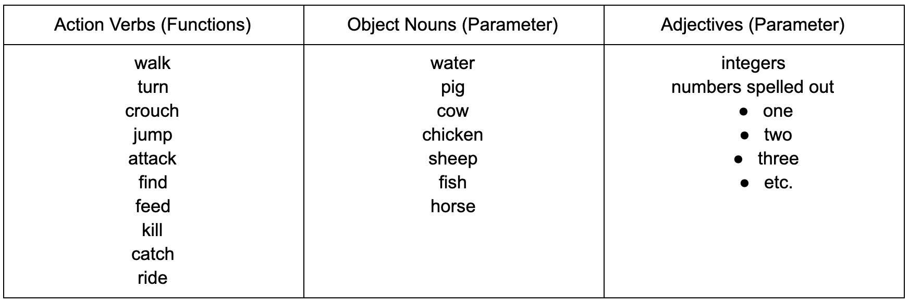

<h2>Final Video</h2>
<iframe width="560" height="315" src="https://www.youtube.com/embed/mslOyz09SFg" frameborder="0" allow="accelerometer; autoplay; clipboard-write; encrypted-media; gyroscope; picture-in-picture" allowfullscreen></iframe>

<h2>Project Summary</h2>

 Minecraft is a video game in which players can create and break apart various types of blocks in a 3-dimensional world. Our project, ChatbotSteve, allows 
players to play the game without manually controlling the character’s actions. ChatbotSteve is essentially a messaging platform between the user and the agent, 
Steve. The player can type or dictate his command to the agent, Steve, and Steve will perform the task assigned to him. In order to complete this project, 
we focused on understanding and applying Natural Language Processing (NLP), which would allow us to interpret English player commands in our own way.

Our interpretation of player commands relied on defining each word’s part-of-speech, then grouping together pairs of action verbs and direct-object nouns. 
One of the challenges we faced while implementing this was how we could use NLP to tag certain words with a certain part of speech. For example, excluding articles
such as ‘the’, ‘a’, or ‘an’ could potentially change the part-of-speech of a noun to an adjective, producing an incomplete pair of verb action and noun object. 
This incorrect deduction of part-of-speech grouping would then prevent the agent from acting out the correct command or prevent the agent from even 
understanding the command. After we realized this problem, we focused on improving upon our NLP application in such a way that agent, Steve, would be able to 
understand various ways a player could give the same command.

Once we created a way for our agent to understand the player, our next step was to code methods which would allow the agent to perform the action desired. 
Our current list of actions ranges from basic commands (walk, jump, crouch, turn) to more complicated ones (find, feed, ride, attack, kill, fish). The basic 
commands were provided by Malmo’s API through the agent.sendCommand() function. One challenge we encountered in implementing these functions was checking 
whether or not Steve had actually finished his task. For example, when commanding “kill the pig”, would Steve be able to attack the pig till it died or would 
it be unable to finish the job if the pig runs away? In order to tackle issues such as these for the more complex commands, we had to access some more 
complicated features of Malmo’s API, such as world_state_observations.

<h2>Approaches</h2>

Our approach to understanding human text relies on NLP, natural language processing. The program is split into two main parts. The first one is a reader 
that contains the implementations of the NLP algorithms that understand the user input. The second part is the execution of the actions in the way that the 
user intended to. In the first part, we choose the python dictionary as the container for all the critical information that we get from the user input about 
actions and their corresponding object because of its property of maintaining the insertion order by default. 

Before getting started with the reader, we research various NLP algorithms to understand how NLP worked. We found the best method to be splitting the user 
command into a list of tuples. Each tuple would be a pair of the word and that word’s part of speech. Also, in real life, there could be misspelling in the 
users input. To minimize the impact of misspelling and maintain the correctness of our model, we add a light-weight spell checker to the initial user input. 
It’s invented by Dr. Peter Norvig, and it uses probability theory to predict the existence of misspelling. It works by finding the correction c from all 
possible candidate corrections that maximizes the probability that c is the intended correction, given the original word w:

- argmax c ∈ candidates P(c|w)
- argmax c ∈ candidates P(c) P(w|c) / P(w)  	(by Bayes’ Theorem)
- argmax c ∈ candidates P(c) P(w|c)

Using NLTK, Natural Language Toolkit, we were able to easily split the user’s commands into the list of tuples, as previously mentioned. A few examples of 
how we are parsing the user command are shown below:

**Sentence:** I want you to walk 
**NLTK:** [('I', 'PRP'), ('want', 'VBP'), ('you', 'PRP'), ('to', 'TO'), ('walk', 'VB')]
 
**Sentence:** I want you to kill 10 skeletons and find one wolf 
**NLTK:** [('I', 'PRP'), ('want', 'VBP'), ('you', 'PRP'), ('to', 'TO'), ('kill', 'VB'), ('10', 'CD'), ('skeletons', 'NNS'), ('and', 'CC'), 
('find', 'VB'), ('one', 'CD'), ('wolf', 'NN')]
 
**Sentence:** I want you to kill a pig and find a cow 
**NLTK:** [('I', 'PRP'), ('want', 'VBP'), ('you', 'PRP'), ('to', 'TO'), ('kill', 'VB'), ('a', 'DT'), ('pig', 'NN'), ('and', 'CC'), ('find', 'VB'), 
('a', 'DT'), ('cow', 'NN')] 

Using NLTK to tokenize our output into tuples of (word, part of speech), we created commands based on the part of speech (if it is a verb) and pass parameters
based on the word (depending on if it’s a noun or an adjective). Our code also takes numbers into consideration and we will run the command as many times as 
the user wants. To make sure all the numbers can be understood correctly, we include a separate script called “american_number_system” in the helper file to 
effectively convert the numbers from string to numerical type. After numbers are properly handled, our reader then detects the existence of verbs in the input
and extracts the information about the target objects before the next verbs are detected. However, this approach won’t be able to handle all the actions if 
there are pronouns in the user input. The image below shows that we needed to read more than just part-of-speech to be able to derive objects from pronouns 
such as “it”, “them”, etc.

To solve this problem efficiently, our approach was to use “NeuralCoref” - a state-of-the-art coreference resolution based on neural nets and Spacy. 
A few examples of how our parsing works after implementing coreference-understandability:

**Sentence:** I want you to find a pig and kill it. 
**NeuralCoref:** {“find”: [[“pig”, 1]], “kill”: [[“pig”, 1]]}

**Sentence:** I want you to find three pigs, feed two chickens and kill them. 
**NeuralCoref:** {“find”: [[“pig”, 3]], “feed”: [[“chicken”, 2]], “kill”: [[“pig”, 3], [“chicken”, 2]]}

Considering the complexity of this project, we choose a small size model “en_coref_sm.” The doc._.has_coref allows us to detect if there is any 
coreference in the input. If there is, the doc._.coref_resolved function returns the user input after all the coreferences are resolved. The image 
below illustrates that our model achieves the goal of coreference resolution.

Finally, to ensure that the singular and plural forms of words wouldn’t cause any confusion, we implemented an inflect engine to effectively convert plural target objects into singular forms.

After creating our dictionary of verb/action, noun/object groups, we iterate through all the actions and their respective nouns. Each action has their own function and each noun is designated to an object in Malmo. All nouns and integers, if specified by the player, will be passed to the verb function as a parameter. For example, the command “find a pig” would equate to find(pig) in code. A command of “feed 5 cows and kill them” would run feed(cow, 5) then kill(cow, 5). Below is a table of all the functions and parameters we have implemented.

<h2>Evaluations</h2>
<h3>Quantitative Evaluations</h3>

Since our project would have a 100% success rate of converting action to function, we implemented a spell checking feature which would automatically correct any misspelled words in the player’s commands. In order to make accurate spell checks, we used Probability Theory to determine the possible candidates for a misspelled word and the quantitative results for misspelling a word. When deciding which possible candidate to use in order to replace the misspelled word, we used Bayes’ Theorem. 

- P(A) - the probability that the candidate word (A) exists as a word in the text
- P(B) - the probability which shows how many times word (B) appears in the text
- P(B|A) - the probability that word (B) would be typed when the player meant word (A)
- P(A|B) - the probability for each candidate word (A) given word (B)

Utilizing the Official Minecraft Players Guide as the text to read from, we use the theorem above to determine the highest probabilities and which candidate words they are associated with. Below are results when testing the most common words in our commands:

These tables show the results for how accurate our spell checker is for the words shown. The first row shows the word we are spell checking. The second row shows the probability the spell checker will correctly spell the word if the word contains one typo. The third row shows the probability the spell checker will correctly spell the word if the word contains two typos. The fourth row shows the combined probability from rows two and three.

The reason we chose to stop at two typos is because most of the words in our commands are only four letters long. Furthermore, we also have a few three letter words. If a player were to make three typos in a single word, most of the time, this would result in an entirely new word. For example, three typos in the word “pig” could possibly be “cow”, which is incorrect in terms of the player’s command but correct in the terms of spell checking to a word that actually exists. This also explains why the error rate for certain words is a lot lower for certain words. For example, the word “pig” drops from a 55% success rate to only a 5% success rate when introducing another typo. On the other hand, the word “chicken” drops from a 100% success rate to a still-very-high 99% success rate. This is because the ratio of typos to length of word is drastically different between the two. While in the word “chicken”, two letters make up 28% of the word; in the word “pig”, two letters make up 67% of the word.

<h3>Qualitative Evaluations</h3>

Since we are using NLTK to process the input commands, we intend to test the accuracy of NLTK’s handling of player commands. The process of NLTK to classify words into their parts of speech or command and labeling them accordingly is known as part-of-speech tagging or POS-tagging. While working on our POS-tagging system, we realized that since there are multiple ways to input the same command, we would have to be prepared for various types of inputs which could mean the same thing. For example, “find the pig” would be the same as “find pig”.

While our POS-tagging system works for smaller commands such as above, we were still unable to figure out how to completely and accurately POS-tag more complex commands such as below. The variations of conjunctions and commas cause our POS-tag to be thrown off slightly. Our findings are talked more in depth in the following qualitative tests.

Our first qualitative test did not include any Coreference inputs. Our test command set has two types of commands and a total of 684 commands. The first is a one verb and one direct object, for example, “feed a pig” or “find three sheep”. The second form consists of two verbs and two direct objects, both actions and animals can be repeated, for example, “find 6 pigs and kill two chickens” or “find a sheep and kill a fish”.

VB: verb(base form),  VBN: verb(past tense), NN: noun(singular), NNS: noun(plural), JJ: adjective, CC: coordinating conjunction

This table shows the results of this test, with the first column showing the words that appear in the test, and the second column showing the part of speech of each of the words that NLTK returns after input test Command into NLTK. For example, if the input is “find a pig and feed a cow”, the NLTK will return [(‘find’, VB), (‘a’, DT), (‘pig’, NN), (‘and’, CC), (‘feed’, VB), (‘a’, DT), (‘cow’, NN)]. Also, after the possible part of speech of each word, there is a parentheses which show the probability and number of times the current word is judged to be that part of speech. From the table above, we found that most of the results were correct, for example, the word “find” was correctly identified as the verb and “horses” was correctly identified as the plural of the noun every time. However, there were three words that were still wrongly identified as incorrect parts of speech. “Feed” was identified as a verb in past tense at 8% and noun at 6.5%, the reason for that is that the past tense of feed is the same as the base form, and feed could have been a noun, which exists in English in rare cases. But for the word “sheep” and “fish”, neither of them could be used as an adjective, the NLTK identified them as JJ(adjective) at 14.7% and 48% respectively. Here are two examples of the error. In the first example, we input “find 10 fish”, but the NLTK assigns fish as JJ(adjective). Also, in the second example, we input “find 10 sheep and feed a fish”, the NLTK assigns sheep as JJ(adjective).  Our hypothesis is that NLTK might try to relate “fish” to the adjective, “fishy”.

The second qualitative test is mainly about coreference. We randomly form 680 different commands that have Coreference in it. For example, for input “find a pig and kill it”, NLTK will return [(‘find’, VB), (‘a’, DT), (‘pig’, NN), (‘and’, CC), (‘kill’, VB), (‘a’, DT), (‘pig’, NN)]. Or input “find four horses and feed them, feed two cows and kill them”, the NLTK will return [(‘find’, VB), (‘four’, CD), (‘horses’, NNS), (‘and’, CC), (‘feed’, VB), (‘four’, CD), (‘horses’, NNS), (‘feed’, VBP), (‘two’, CD), (‘cows’, NNS), (‘and’, CC), (‘kill’, VB), (‘two’, CD), (‘cows’, NNS)]

VB: verb(base form),  VBN: verb(past tense), VBP: verb(sing. present, non-3d), NN: noun(singular), NNS: noun(plural), JJ: adjective, CC: coordinating conjunction, RB: adverb, PRP: personal pronoun

The table shows the accuracy of assigning POS by NLTK, comparing with the test without Coreference, the accuracy of most words were decreased. For example, “feed” was assigned as a noun at 24.5% at this table, which increased about 18% from the first test table. Also, the animal words like “pig” and “chicken” were identified as JJ(adjective) at 3.8% and 12% respectively in this test. Based on the code we used earlier to handle Coreference, it turns “it” and “them” into their corresponding actions and target animals, which means that there should not have “it” or “them” in the table. But “them” appeared 5 times.

<h2>References</h2>
- [Malmo XML Schema Documentation](http://microsoft.github.io/malmo/0.30.0/Schemas/Mission.html)
- [Natural Language Toolkit](https://www.nltk.org/)
- [inflect](https://pypi.org/project/inflect/)
- [word2number library](https://pypi.org/project/word2number/)
- [Neural Coreference for Chatbots](https://medium.com/huggingface/state-of-the-art-neural-coreference-resolution-for-chatbots-3302365dcf30)
- [Norvig Spelling Corrector](https://norvig.com/spell-correct.html)
